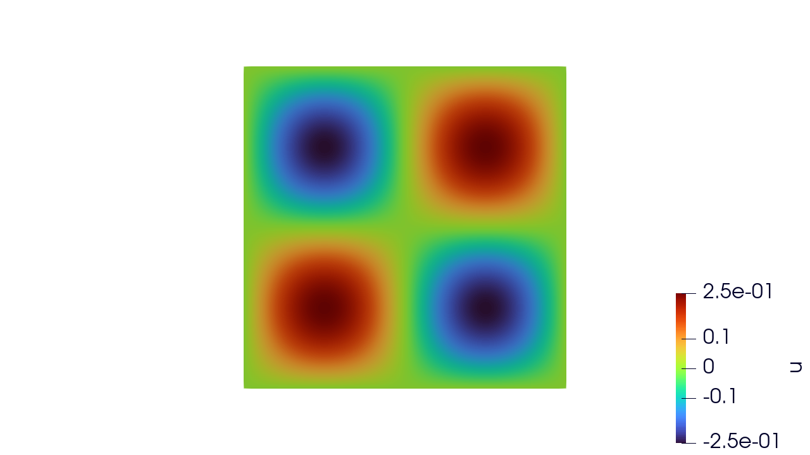
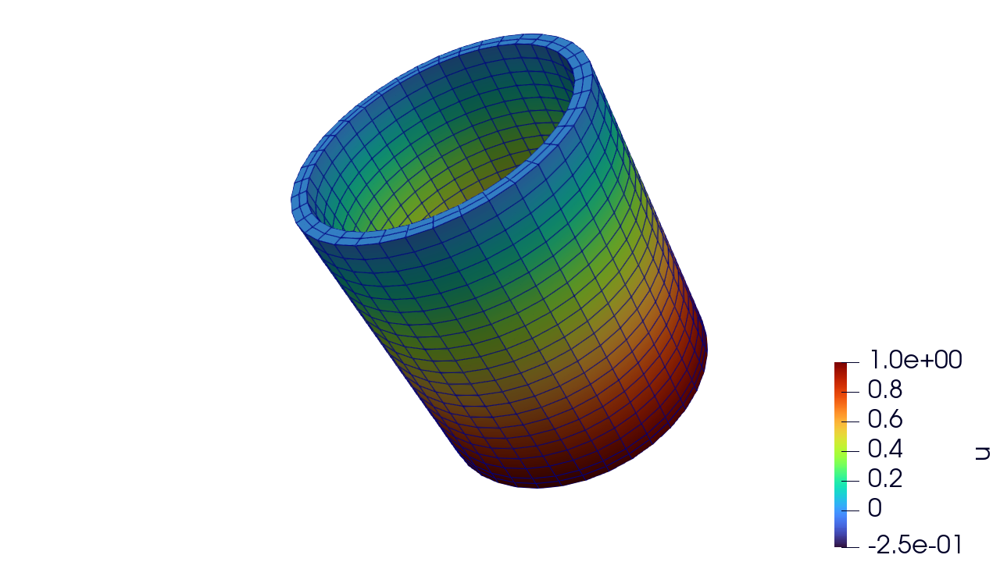

# 1. Poisson Equation

## Strong Form
Consider the Poisson equation on a domain ``\Omega \subset \mathbb{R}^d`` with boundary ``\partial \Omega``:

``-\nabla \cdot \nabla u = f \quad \text{in } \Omega,``
 

with Dirichlet boundary conditions

``u = g \quad \text{on } \partial \Omega_D,``

and Neumann boundary conditions


``\nabla u \cdot n = h \quad \text{on } \partial \Omega_N,``

where ``f`` is a source term, and ``n`` is the outward normal vector on the boundary.

## Weak Form

To derive the weak form, multiply the PDE by a test function ``w \in V_0`` which is zero on ``( \partial \Omega_D )`` and integrated over ``\Omega``:

``-\int_\Omega v \, (\nabla \cdot \nabla u) \, d\Omega = \int_\Omega v \, f \, d\Omega``

Applying integration by parts to the left-hand side:

``\int_\Omega \nabla v \cdot \nabla u \, d\Omega - \int_{\partial \Omega} v \, (\nabla u \cdot n) \, d\Gamma = \int_\Omega v \, f \, d\Omega``

Using the boundary conditions:

``\int_\Omega \nabla v \cdot \nabla u \, d\Omega = \int_\Omega v \, f \, d\Omega + \int_{\partial \Omega_N} v \, h \, d\Gamma``

## Finite Element Formulation

Let ``V_h \subset V`` be a finite-dimensional space of trial functions and test functions. The discrete weak form is:


``\text{Find } u_h \in V_h \text{ such that } 
\int_\Omega \nabla v_h \cdot \nabla u_h \, d\Omega = \int_\Omega v_h \, f \, d\Omega + \int_{\partial \Omega_N} v_h \, h \, d\Gamma
\quad \forall v_h \in V_h.
``

## Shape function values

Each element ``\Omega_e`` is mapped to a **reference element** ``\hat{\Omega}`` via a geometric mapping:

``
x(\hat{\xi}) = \sum_{i=1}^{n_\text{nodes}} N_i(\hat{\xi}) \, x_i
``

where:

- ``N_i(\hat{\xi})`` are the **shape functions** on the reference element  
- ``x_i`` are the **physical node coordinates**  
- ``\hat{\xi} \in \hat{\Omega}`` is the reference coordinate  

NOTE: All of this is handled internally. The user does not need to implement this.
This is just shown for completeness for those not familiar with the nuts and bolts
of the finite element method.

## Shape function gradients

To compute ``\nabla u_h`` in the physical element, we use the chain rule:

``
\nabla u_h(x) = \sum_{i=1}^{n_\text{nodes}} u_i \, \nabla N_i(x)
= \sum_{i=1}^{n_\text{nodes}} u_i \, J^{-T} \, \hat{\nabla} N_i(\hat{\xi})
``

where:

- ``\hat{\nabla} N_i(\hat{\xi})`` are gradients in the reference element  
- ``J`` is the **Jacobian matrix** of the mapping:

``
J = \frac{\partial x}{\partial \hat{\xi}} = \sum_{i=1}^{n_\text{nodes}} x_i \, \hat{\nabla} N_i(\hat{\xi})^T
``

- ``J^{-T}`` maps reference gradients to physical gradients.  

The determinant of the Jacobian, ``|J|``, scales the quadrature weights when integrating:

NOTE: All of this is handled internally. The user does not need to implement this.
This is just shown for completeness for those not familiar with the nuts and bolts
of the finite element method.Shape function values

## Element-wise Assembly with Quadrature

The domain ``\Omega`` is divided into finite elements ``\Omega_e``, and the integrals are computed element-wise:

``
\int_\Omega \nabla v_h \cdot \nabla u_h \, d\Omega
= \sum_{e} \int_{\Omega_e} \nabla v_h \cdot \nabla u_h \, d\Omega
``

Each element integral is approximated using quadrature:

``
\int_{\Omega_e} \nabla v_h \cdot \nabla u_h \, d\Omega
\approx \sum_{q=1}^{N_q} w_q \, |J(\hat{\xi}_q)|
(\nabla v_h(x(\hat{\xi}_q)) \cdot \nabla u_h(x(\hat{\xi}_q)))
``

where:

- ``x_q`` are the quadrature points in the element ``\Omega_e``  
- ``w_q`` are the associated quadrature weights  
- ``N_q`` is the number of quadrature points in the element  


## Implementation
Currently, ```FiniteElementContainers``` expects a set of functions that can be provided to the assemblers that represent
concepts such as energies, residuals (gradients), and stiffnesses (hessians). Below is an implementation of the above Galerkin finite element formulation in forms suitable to work with the rest of the ```FiniteElementContainers``` machinary. 
These methods will works on all currently tested backends (e.g. CPU, CUDA, and RocM).

We can take the above equation and represent a discrete residual equation

``
R_a = \int_\Omega \nabla N^a \cdot \nabla u^a \, d\Omega - \int_\Omega N^a \, f \, d\Omega - \int_{\partial \Omega_N} N^a \, h \, d\Gamma
``
than a suitable tangent (stiffness, or whatever you prefer to call it) for a Newton type method is the following

``
K_{ab} = \frac{\partial R_a}{\partial u_b} = \int_\Omega \nabla N^a \cdot \nabla N^b d\Omega
``

First we need to create a type for our new physics. We do this by creating a subtype of ```AbstractPhysics``` as follows

```julia
struct Poisson{F <: Function} <: AbstractPhysics{1, 0, 0}
  func::F
end
```

In the above we create a new type called ```Poisson``` that has a single field, our driving function ``f``. This type is a subtype of ```AbstractPhysics``` which has three
required generic fields, the number of fields per entity (e.g. node, face, etc.) in the physics (here 1), the number of properties per element, and the number of state variables per quadrature point. For the simple case of a Poisson equation we do not have properties or state variables so these are simply zero. We will explore examples of physical models that require properties and state variables in future tutorials.

Now that we have a type associated with our physics, we can implement the necessary methods for our example. We need a residual method and a stiffness method.

Let's start with the residual method.

```julia
@inline function FiniteElementContainers.residual(
  physics::Poisson, interps, x_el, t, dt, u_el, u_el_old, state_old_q, state_new_q, props_el
)
  interps = map_interpolants(interps, x_el)
  (; X_q, N, ∇N_X, JxW) = interps
  ∇u_q = interpolate_field_gradients(physics, interps, u_el)
  R_q = ∇u_q * ∇N_X' - N' * physics.func(X_q, 0.0)
  return JxW * R_q[:]
end
```

Let's now unpack what probably looks like a fairly complex method at first glance, especially for such a simple equation. 
- The ```@inline``` macro is required to ensure this runs on GPU backends. Without this you'll likely run into hard to debug GPU errors that may differ from device to device. The first argument to the method is our physics type we defined above. 
- The second argument is a set of interpolation function values, gradients, and hessians for the reference element of a given block. Note that this method is defined in a such a way that it is element agnostic and operates on a single quadrature point. So the ```interps``` input is a set of shape function values, gradients, hessians, etc. for a given quadrature points. - The next three inputs are the element level coordinates ```x_el```, the current time ```t```, and the current time step ```dt```. 
- The next two inputs are the current and old element level solution fields ```u_el``` and ```u_el_old```. 
- These are followed by the quadrature level current and old state variables ```state_old_q``` and ```state_new_q``` and the element level properties ```props_el```. A lot of these fields are completely unnecessary for a problem as simple as the Poisson equation, but they will reveal their usefulness in more compex tutorials. They are required for all physics so we do not need to write a bunch of duplicated assembly methods. Working with varargs on potentially different types on GPUs can be tricky.

Now let's walk through the actual method body. The first two lines

```julia 
interps = map_interpolants(interps, x_el)
(; X_q, N, ∇N_X, JxW) = interps
```
maps the quadrature level shape function values, and gradients to the current element configuration and unpacks
the mapped interpolants. ```X_q``` is the quadrature point coordinates in the physical space, ```N``` is the shape function value, ```∇N_X``` is the shape function gradient in the physical space, and ```JxW``` is the determinant of the mapping Jacobian times the Guass quadrature weight.

The next line calls a helper method
```julia
∇u_q = interpolate_field_gradients(physics, interps, u_el)
```
which uses the shape function gradients and the element level solution field to calculate the quadrature level
solution field gradient. 

Finally, in the last two lines we compute the residual, integrate it, and return to the calling method.
```julia
R_q = ∇u_q * ∇N_X' - N' * physics.func(X_q, 0.0)
return JxW * R_q[:]
```

For the stiffness method we can define this analytically as
```julia
@inline function FiniteElementContainers.stiffness(
  physics::Poisson, interps, x_el, t, dt, u_el, u_el_old, state_old_q, state_new_q, props_el
)
  interps = map_interpolants(interps, x_el)
  (; X_q, N, ∇N_X, JxW) = interps
  K_q = ∇N_X * ∇N_X'
  return JxW * K_q
end
```
or we could use an AD engine if we're feeling lazy.

With these two methods, we have everything we need to assemble the residual and stiffness matrix
necessary for a standard Newton method. 

## Two-dimensional problem - Poisson on a square
Let's now solve an actual problem with the methods defined above. Rolling together a simple problem is very straightforward in ```FiniteElementContainers.jl``` and can be achieved in very little code.

Below is an actual example of a homogenous Dirichlet problem on a square. We will use
the following forcing function 

``
f(x, y) = 2π^2 sin(πx) sin(πy)
``

```julia
using FiniteElementContainers

# setup some helper functions for f and the bcs rhs
f(X, _) = 2. * π^2 * sin(π * X[1]) * sin(π * X[2])
bc_func(_, _) = 0.

mesh_file = "my_mesh.exo"
mesh = UnstructuredMesh(mesh_file)
V = FunctionSpace(mesh, H1Field, Lagrange) 
physics = Poisson(f)
props = create_properties(physics)
u = ScalarFunction(V, :u)
asm = SparseMatrixAssembler(u; use_condensed=use_condensed)

# setup bcs
dbcs = DirichletBC[
    DirichletBC(:u, bc_func; nodeset_name = :nset_1),
    DirichletBC(:u, bc_func; nodeset_name = :nset_2),
    DirichletBC(:u, bc_func; nodeset_name = :nset_3),
    DirichletBC(:u, bc_func; nodeset_name = :nset_4),
]

# setup the parameters
p = create_parameters(mesh, asm, physics, props; dirichlet_bcs=dbcs)

# setup a solver
solver = NewtonSolver(DirectLinearSolver(asm))

# setup an integrator and let it all evolve one time step
integrator = QuasiStaticIntegrator(solver)
evolve!(integrator, p)

# grab our full solution field from our parameters
U = p.h1_field

# post process results to exodus file
output_file = "my_output.exo"
pp = PostProcessor(mesh, output_file, u)
write_times(pp, 1, 0.0)
write_field(pp, 1, ("u",), U)
close(pp)
```

This has the following visual solution



# Three dimensional Dirichlet problem
Now let's look at another problem with same exact code but with a few modifications to boundary conditions, the forcing function, and the mesh file name. We're going to mimic the tutorial from the first tutorial from [MOOSE](https://mooseframework.inl.gov/getting_started/examples_and_tutorials/examples/ex01_inputfile.html)

```julia
using FiniteElementContainers

# setup some helper functions for f and the bcs rhs
f(_, _) = 0.0
one_func(_, _) = 1.0
zero_func(_, _) = 0.0

mesh_file = "mug.e"
mesh = UnstructuredMesh(mesh_file)
V = FunctionSpace(mesh, H1Field, Lagrange) 
physics = Poisson(f)
props = create_properties(physics)
u = ScalarFunction(V, :u)
asm = SparseMatrixAssembler(u; use_condensed=use_condensed)

# setup bcs
dbcs = [
    DirichletBC(:u, one_func; sideset_name = :bottom)
    DirichletBC(:u, zero_func; sideset_name = :top)
]
# setup the parameters
p = create_parameters(mesh, asm, physics, props; dirichlet_bcs=dbcs)

# setup a solver
solver = NewtonSolver(DirectLinearSolver(asm))

# setup an integrator and let it all evolve one time step
integrator = QuasiStaticIntegrator(solver)
evolve!(integrator, p)

# grab our full solution field from our parameters
U = p.h1_field

# post process results to exodus file
output_file = "my_output.exo"
pp = PostProcessor(mesh, output_file, u)
write_times(pp, 1, 0.0)
write_field(pp, 1, ("u",), U)
close(pp)
```


