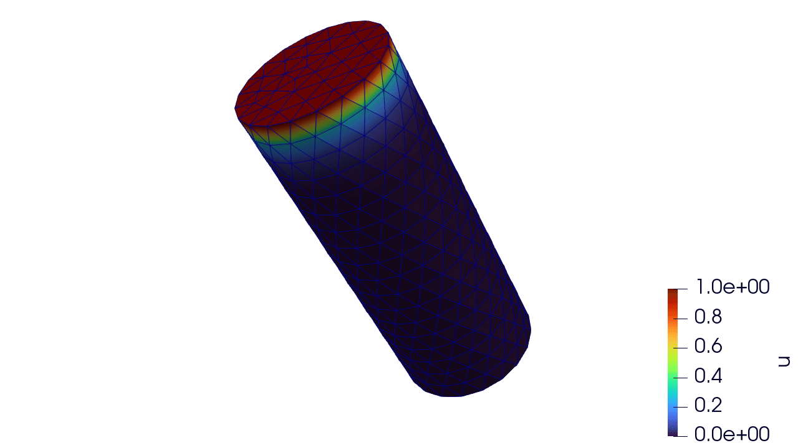

# 4. Transient Problem

This example mimics the second [Moose tutorial](https://mooseframework.inl.gov/getting_started/examples_and_tutorials/examples/ex06_transient.html).


## Strong Form
Consider the Poisson equation on a domain ``\Omega \subset \mathbb{R}^d`` with boundary ``\partial \Omega``:

``\frac{\partial u}{\partial t} -\nabla \cdot \nabla u = 0\quad \text{in } \Omega,``
 
with initial conditions
``u(x) = u_0(x)``

with Dirichlet boundary conditions

``u = g \quad \text{on } \partial \Omega_D,``

and Neumann boundary conditions


``\nabla u \cdot n = h \quad \text{on } \partial \Omega_N,``

## Weak form
``
\int_\Omega \nabla v \cdot \nabla u \, d\Omega + \int_\Omega v \frac{\partial u}{\partial t}d\Omega = \int_{\partial \Omega_N} v \, h \, d\Gamma
``
where for simplicity we will approximate the time derivate by the following first order approximation

``
\frac{\partial u}{\partial t} = \frac{u_{n + 1} - u_n}{\Delta t}
``

## Implementation
```julia
struct Transient <: AbstractPhysics{1, 0, 0}
end

@inline function FiniteElementContainers.residual(
    physics::Transient, interps, x_el, t, dt, u_el, u_el_old, state_old_q, state_new_q, props_el
)
    interps = map_interpolants(interps, x_el)
    (; X_q, N, ∇N_X, JxW) = interps
    u_q, ∇u_q = interpolate_field_values_and_gradients(physics, interps, u_el)
    u_q_old = interpolate_field_values(physics, interps, u_el_old)
    ∇u = unpack_field(∇u_q, 1)
    dudt = 20. * (u_q[1] - u_q_old[1]) / dt
    R = dudt * N + ∇N_X * ∇u
    return JxW * R[:]
end
  
@inline function FiniteElementContainers.stiffness(
    physics::Transient, interps, x_el, t, dt, u_el, u_el_old, state_old_q, state_new_q, props_el
)
    interps = map_interpolants(interps, x_el)
    (; X_q, N, ∇N_X, JxW) = interps
    K_q = (20. / dt) * N * N' + ∇N_X * ∇N_X'
    return JxW * K_q
end
```

## Example problem
```julia
mesh = UnstructuredMesh("cyl-tet.e")
times = TimeStepper(0., 75., 75)
V = FunctionSpace(mesh, H1Field, Lagrange)
physics = Transient()
props = create_properties(physics)
u = ScalarFunction(V, :u)
asm = SparseMatrixAssembler(u; use_condensed=true)
dbcs = [
    DirichletBC(:u, zero_func; sideset_name = :bottom)
    DirichletBC(:u, one_func; sideset_name = :top)
]
U = create_field(asm)
p = create_parameters(
    mesh, asm, physics, props; 
    dirichlet_bcs = dbcs,
    times = times
)
solver = NewtonSolver(DirectLinearSolver(asm))
integrator = QuasiStaticIntegrator(solver)
pp = PostProcessor(mesh, "output.e", u)

n = 1
while times.time_current[1] < 75.0
    evolve!(integrator, p)
    U = p.h1_field
    write_times(pp, n, times.time_current[1])
    write_field(pp, n, ("u",), U)
    n = n + 1
end

close(pp)
```

Visualization
